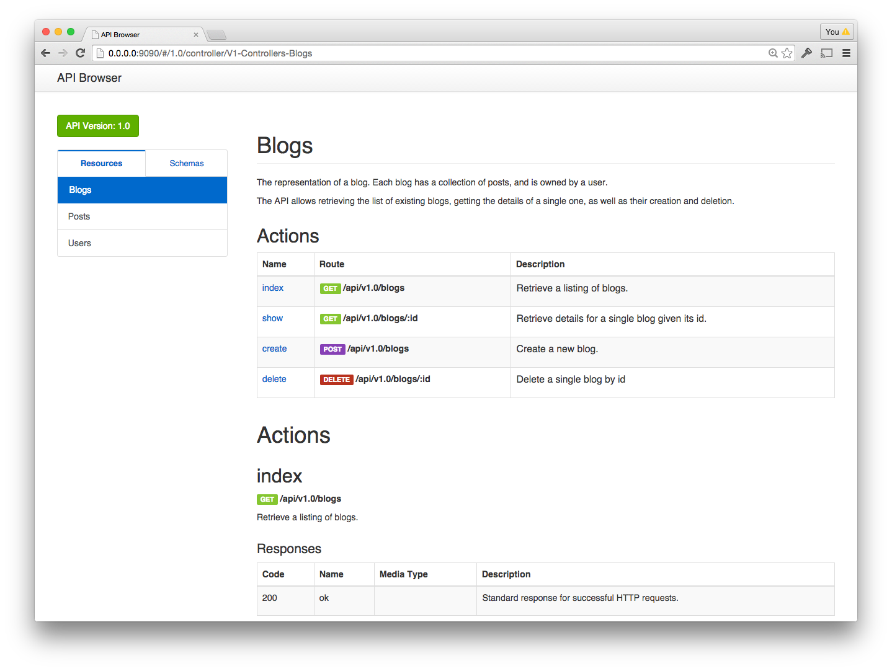

# Bloggy Example Praxis Application

[](https://travis-ci.org/rightscale/praxis-example-app)
[](https://coveralls.io/github/rightscale/praxis-example-app?branch=master)

Bloggy is a simple (and nowhere near feature-complete) example of a Praxis application. It's designed to demonstrate a various features of Praxis and show the overall structure of a full application.

See the [Getting Started](http://praxis-framework.io/getting-started/) guide on the Praxis website for more information about the structure of a Praxis application.

This example application defines three different API resources: a Blog, a Post and a User. Only controllers for Blogs and Posts are implemented, leaving the Users one as an excercise left to the reader :).

Of particular note, is that its two controllers, `V1::Controllers::Posts` and `V1::Controllers::Blogs` each demonstrate a different way to interact with a database while still using the same defined Sequel models:
  * `Posts` the straight Sequel API you're used to in any other application.
  * `Blogs` uses the optional praxis-mapper library with the same Sequel models to populate an identity map, eliminating redundant data access and ensuring object identity across relationships for identical records.

It is also worth noting that while Users controller is not implemented, anything else related to users is, making it fairly easy for the intrepid to complete task task. In that sense, the application comes with its media-type fully defined, appropriate Sequel models and DB tables as well as the wraping mapper resources. Building the controller simply involves designing its API through a resource definition, creating the controller class with methods which implement the defined actions, and start using the existing Sequel (or Mapper) models, and rendering them with the existing media-type objects and views.

## Setting up the Application

To setup the application fo the first time:
```sh
  bundle install
  bundle exec rake db:setup
  bundle exec rake db:seed
```

That will install the necessary gems, setup the database and populate it with example data.

## Generating Documentation

To generate the API documentation and open in web browser:
```sh
  bundle exec rake praxis:docs:preview
```

Which should give you something like this:


Changes in the design will be automatically reflected in the browser (might take 1 or 2 seconds to refresh).

This app also provides a simple example in [here](docs/views/home.html) of how to customize the home page of the doc browser. For more information about this, and other customizations please visit the Praxis [wiki](https://github.com/rightscale/praxis/wiki/Doc-Browser-Customisation-Recipes)

## Running the Application

Simply use your favorite rack server. For example, WEBrick:
```sh
  bundle exec rackup
```

The API will now be available from localhost using the port number chosen by your Rack server above. For example, you can retrieve the list of Blogs created by the previous `db:seed` task by issuing the current `curl` command:
```sh
  curl http://localhost:9292/api/v1.0/blogs
```

To see the full list of actions and routes that the application exposes you can do:
```sh
  bundle exec rake praxis:routes
```

## License

This software is released under the [MIT License](http://www.opensource.org/licenses/MIT). Please see  [LICENSE](LICENSE) for further details.

Copyright (c) 2015 RightScale
